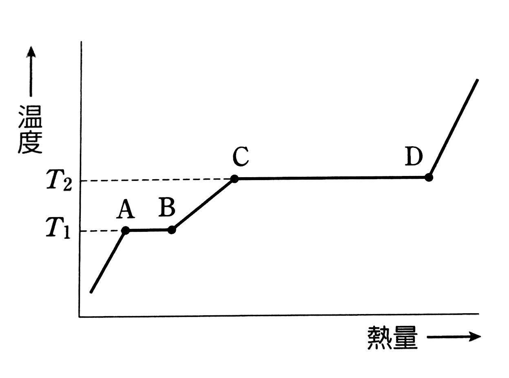
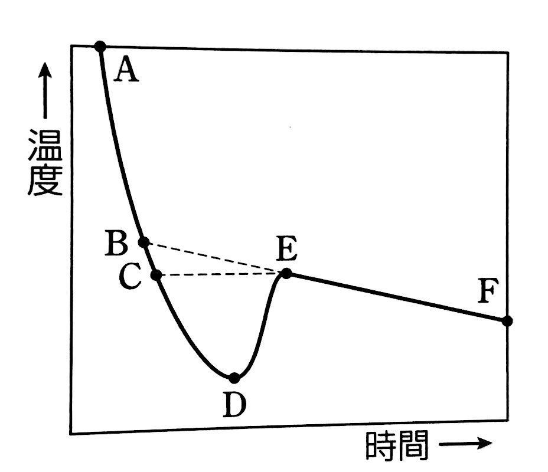

# 2年_前期中間_化学

---

### 用語

- 状態変化に伴って熱の出入りがある
- それぞれ$1mol$が状態変化するのに必要な熱エネルギーの量(熱量)
- 融解熱 = 凝固熱 ,  蒸発熱 = 凝縮熱
- $A-B$間を融解熱(凝固熱)
- $C-D$間を蒸発熱(凝縮熱)

---

- 196.3 - $A-B$間で温度が上昇していないのはなぜか
  - 与えられた熱エネルギーの全てが状態変化に使われるため

---

- 203.4 - $C-D$間は$A-B$間よりも多くの熱量を必要とするのはなぜか
  - 水分子間力に働く引力を完全に断ち切って水蒸気にするために必要な熱量は、氷を構成する水分子の配列を崩すために必要な熱量よりもはるかに大きいため

---

- 226 - 水とヘキサン
  - 水にはよく溶けるが、ヘキサンには溶けにくい
    - 塩化ナトリウム - $NaCl$
    - 塩化水素 - $HCL$
    - 硝酸カリウム - $KNO_3$
    - スクロース - $C_{12}H_{22}O_{11}$
    - グルコース - $C_{6}H_{12}O_{6}$
  - ヘキサンにはよく溶けるが、水には溶けにくい
    - ヨウ素 - $I_{2}$
    - ナフタレン - $C_{10}H_{8}$
  - 水にもヘキサンにもよく溶ける
    - エタノール - $C_{2}H_{5}OH$

---

- 232.1 - 凝固点 - $B$

- 232.2 - $D$からE$$で急激に温度が上昇するのなぜか
  - 過冷却を脱して急激に溶媒が凝固しはじめると、多量の凝固熱が発生するから

---

- 232.3 - 図中の直線$E-F$が右下がりになる理由を記せ
  - 溶媒だけが凝固するため、残った溶液の濃度が次第に大きくなり、溶液の凝固点効果によって凝固する温度は低下していく

---

### 漢字 

