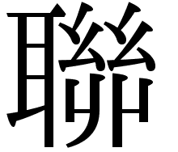
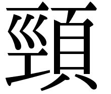

# 2年_前期中間_古典

---

### 漢詩
- 漢詩
  - 古代詩
    - 唐代以前の詩
    - 自由な形式
  - 近体詩
    - 唐代に完成
    - 主流

---

- 押韻
  - 韻を踏む
  - 五言
    - 2, 4句
  - 七言
    - 1, 2, 4句

---

- 詩の構成
  - 絶句
    - 起句
      - うたい起こし
    - 承句
      - 承け
    - 転句
      - 趣を一転
    - 結句
      - 全体をまとめて結ぶ

---

- 詩の構成
  - 律詩
    - 首聯
      - 1, 2句
    - 頷聯
      - 3, 4句
      - 3と4で対句
    - 頸聯
      - 5, 6句
      - 5と6で対句
    - 尾聯
      - 7, 8句

---

### 漢字

---

